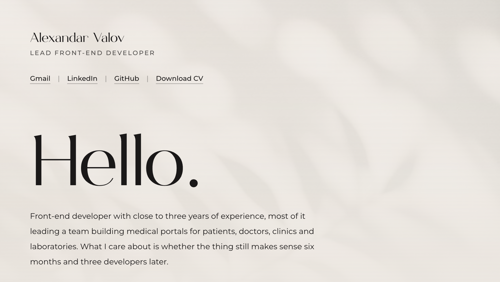

[Gmail](mailto:alexvulov123@gmail.com) · [LinkedIn](https://www.linkedin.com/in/alexandar-valov) · [GitHub](https://github.com/JustAlex-WebDev) · [Download CV](https://raw.githubusercontent.com/JustAlex-WebDev/JustAlex-WebDev/main/Alexandar-Valov-CV.pdf)

### About

I got into web development the way most people do, messing around and building things. What kept me going was realizing how much the front end actually matters. Not just visually, but architecturally.

How you structure components, how a team scales a codebase, how a doctor using a medical portal at 2am needs things to just work: that's what interests me more than chasing the latest framework.

I care a lot about the details, the kind users don't notice when they're right, but feel immediately when they're wrong.

### Skills

**Languages:** HTML5 / CSS3 / JavaScript (ES6+) / TypeScript

**Frameworks & Libraries:** React / Next.js / Vue / Nuxt

**Styling:** CSS / Tailwind / SCSS / Vuetify

**Tools & Platforms:** Git / Figma / Jira / Firebase

### Experience

**SKYWARE Group** · Lead Front-End Developer
Nov 2024 – Aug 2026

Led a cross-functional team building a suite of interconnected medical platforms for patients, doctors, clinics and laboratory staff.

Architected and built the complete UI/UX of multiple platforms from scratch, following Material Design conventions.

Owned the full release pipeline and acted as product owner, bridging the development team and stakeholders.

**buglab** · Front-End Developer
Dec 2023 – Sep 2024

Built a custom design system from scratch, modernizing the platform's UI across the entire codebase.

Owned all UI/UX decisions from initial Figma wireframes through to production, maintaining a documented component library with design tokens and variants.

Built end-to-end user onboarding workflows requiring deep understanding of the platform's architecture and product logic.

### Education

**University of Plovdiv "Paisii Hilendarski"**
Bachelor's degree, Computer Software Engineering
Jul 2023 – Jul 2027

**Cambridge Advanced Certificate in English (CAE)**
Nov 2022
